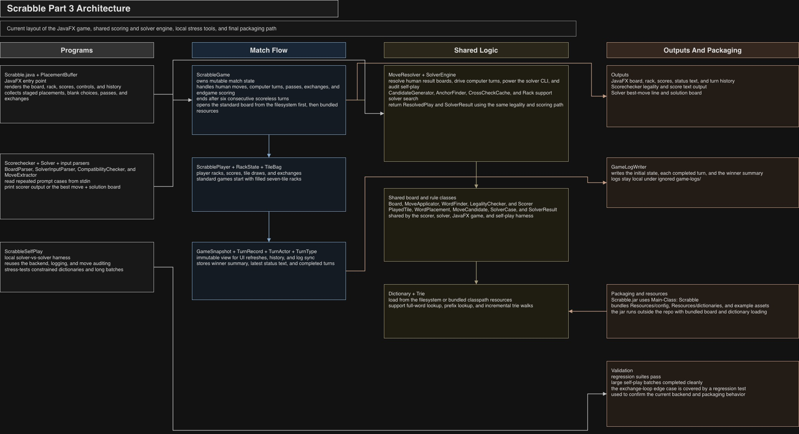

# Scrabble AI

A Java Scrabble project that combines a playable JavaFX interface, a
highest-scoring move solver, shared backend game logic, and large self-play
regression runs. The repository brings the scoring engine, solver, UI, and
test infrastructure together in one codebase so the game logic can evolve
coherently across interactive play and automated validation.

## Start Here
- If you want to review the project quickly, start with [docs/REVIEW_GUIDE.md](docs/REVIEW_GUIDE.md).
- If you want to contribute, start with [CONTRIBUTING.md](CONTRIBUTING.md).
- If you just want to run the scorer, solver, or UI, use the quick-start commands below.

## Current Status
- A scorer validates and scores candidate moves against configurable dictionaries.
- A solver computes highest-scoring moves for a given board state and rack.
- The backend game model handles legality checking, move application, rack state,
  turn history, exchanges, passes, and endgame scoring.
- The JavaFX shell supports board rendering, rack interaction, blank-tile
  handling, computer turns, and turn-history display.
- The current backend has also been stress-tested with large solver-vs-solver self-play batches, including a 1000-game run on the default dictionary and 500-game runs on constrained edge-case dictionaries.

## Project Layout
- `src/`
  Core game, solver, parsing, and UI classes
- `tests/`
  Public regression suites for scorer behavior, solver foundations, and game-state logic
- `Resources/dictionaries/`
  Dictionaries used by the scorer, solver, and UI
- `Resources/config/`
  Board and tile configuration files
- `Resources/examples/`
  Example scorer and solver input/output cases
- `docs/`
  Architecture and review-oriented documentation
- root `.jar` files
  Prebuilt scorer, solver, and UI artifacts for quick evaluation

## Architecture Snapshot

The repository includes a high-level architecture diagram:



## Quick Start

If you just want to try the console tools, the repository includes prebuilt
`Scorechecker.jar`, `Solver.jar`, and `Scrabble.jar` artifacts at the root.
The console tools work with a standard JDK; the JavaFX UI requires a
JavaFX-enabled runtime.

## Scorer and Solver
Both console programs read repeated cases from standard input until EOF.

Run the scorer:

```sh
java -jar Scorechecker.jar Resources/dictionaries/sowpods.txt < Resources/examples/example_score_input.txt
```

Run the solver:

```sh
java -jar Solver.jar Resources/dictionaries/sowpods.txt < Resources/examples/example_input.txt
```

Verify scorer output against the provided example:

```sh
java -jar Scorechecker.jar Resources/dictionaries/sowpods.txt < Resources/examples/example_score_input.txt > /tmp/scorechecker-output.txt
ruby -e 'expected = File.read("Resources/examples/example_score_output.txt").gsub("\r\n", "\n"); actual = File.read("/tmp/scorechecker-output.txt").gsub("\r\n", "\n"); abort("output mismatch") unless expected == actual'
```

Verify solver output against the provided example:

```sh
java -jar Solver.jar Resources/dictionaries/sowpods.txt < Resources/examples/example_input.txt > /tmp/solver-output.txt
ruby -e 'expected = File.read("Resources/examples/example_output.txt").gsub("\r\n", "\n"); actual = File.read("/tmp/solver-output.txt").gsub("\r\n", "\n"); abort("output mismatch") unless expected == actual'
```

The solver keeps the first highest-scoring move it encounters when scores tie,
which makes repeated runs deterministic.

## Backend Highlights
The current game backend supports:
- human and computer players with independent racks and scores
- a mutable tile bag with standard Scrabble tile frequencies
- solver-driven computer turns
- validated human moves through board transitions or `PlacementBuffer.java`
- passes, exchanges, turn history, the standard six-consecutive-scoreless-turn ending, and endgame leave scoring
- immutable UI snapshots through `GameSnapshot.java`

This is intended to let the JavaFX layer focus on rendering and interaction instead of re-implementing game rules.

## Scrabble UI
Run the JavaFX game from IntelliJ with a JavaFX-enabled JDK, or from the
terminal after exporting `JAVA_HOME` to a JavaFX-enabled installation and
compiling the sources:

```sh
javac -d build/classes src/*.java
java -cp build/classes Scrabble
```

You can also pass a dictionary path explicitly:

```sh
java -cp build/classes Scrabble Resources/dictionaries/sowpods.txt
```

Each JavaFX game session also writes a move log under `game-logs/`. That directory is ignored by git so generated logs stay local.

## Scrabble UI Dictionary Behavior
The JavaFX game in `Scrabble.java` accepts an optional dictionary path as its
first command-line argument.

If no argument is provided, it defaults to:

```text
Resources/dictionaries/dictionary.txt
```

If you want to launch the UI with a different dictionary, pass the path explicitly when running `Scrabble`.

## Java Setup
The desktop UI needs a JavaFX-enabled JDK. One convenient option is a Zulu FX
distribution, but any equivalent JavaFX-enabled setup works.

If you want terminal `java` and `javac` to use the same JDK as the IDE, use:

```sh
export JAVA_HOME=/Library/Java/JavaVirtualMachines/zulu-25.jdk/Contents/Home
export PATH="$JAVA_HOME/bin:$PATH"
```

Plain shell `javac` against a non-JavaFX JDK will fail on `javafx.*` imports,
so the UI should be built with a JavaFX-enabled runtime.

## Validation
The public repository snapshot includes both runnable regression suites and the
bundled scorer/solver example cases.

Compile the current source tree from the repository root:

```sh
javac -d build/classes $(find src -name '*.java' ! -name 'Scrabble.java' -print) tests/*.java
```

Run the public regression suites:

```sh
java -cp build/classes ScorecheckerSoFarTests
java -cp build/classes Part2FoundationTests
java -cp build/classes Part3GameTests
```

Run the scorer and solver against the example files:

```sh
java -jar Scorechecker.jar Resources/dictionaries/sowpods.txt < Resources/examples/example_score_input.txt
java -jar Solver.jar Resources/dictionaries/sowpods.txt < Resources/examples/example_input.txt
```

These regression suites exercise the scorer, solver, and game backend. The
JavaFX UI still needs a JavaFX-enabled JDK and is covered separately by the UI
run instructions above.
